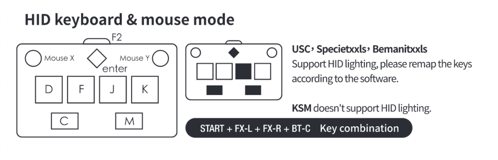

# Sound Voltex key mapper for [コナステ version](https://p.eagate.573.jp/game/eacsdvx)

> 
>
> Modes and key combinations, [FAUCETWO MANUAL](https://gamo2.com/en/download/Faucetwo_manual_en_20210106.pdf)

- mouseX ➡️ left knob control (<kbd>q</kbd>/<kbd>w</kbd>)
- mouseY ➡️ right knob control (<kbd>o</kbd>/<kbd>p</kbd>)

## Development background

The [GlovePIE](https://github.com/Ravbug/GlovePIE) is great game key mapper, but I felt uncomfortable that the key mapping script could not be automatic executed when focusing on a specific game application.

Although it is manual 😮‍💨.. I thought it would be better to have a function to run a script with a shortcut key instead of a GUI button.

## Usage

1. Install [pipenv](https://pypi.org/project/pipenv/)
2. run `pipenv install`
3. run `python3 app.py` (require administrator permission)
   - enable override mouse input with <kbd>shift+p+i</kbd> shortcut
   - disable override mouse input with <kbd>shift+p+i+e</kbd> shortcut

## TODO

- Fix [#1](https://github.com/x86chi/SDVX-key-mapper/issues/1) Bug (currently not working 😕)
- [ ] Ability to override mouse input when focusing on a specific game application
- [ ] CLI to GUI
